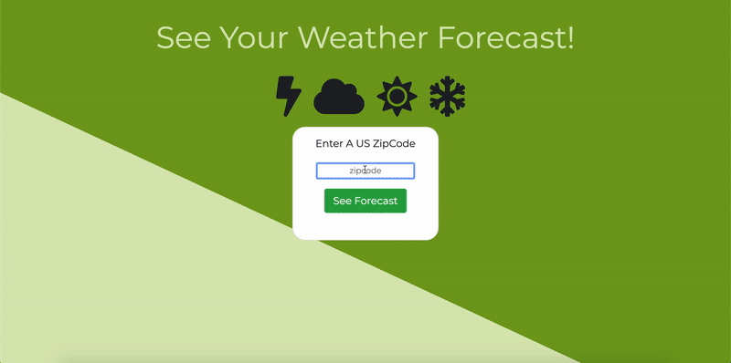

# Weather Dashboard
Weather dashboard web application using OpenWeatherMap's 5 day forecast API. (https://openweathermap.org/api)

The user provides a zipcode and is displayed a responsive dashboard for that location's weather for the upcoming week.

Heroku Deployment: https://openweathermapforecast.herokuapp.com/

## Gif Of Usage

## Installation and Setup Instructions

Clone down this repository. You will need `node` , `npm` and installed globally on your machine.  

You will also need to obtain an API key in order to interact with the API. See documentation (https://openweathermap.org/api)

Installation:

`npm i`

To Start Server:

Open A new terminal session and run `node app.js` in the project directory.

To Visit App:

`localhost:3000`

## Reflection

The stack used here is: Node.js, Javascript, EJS, Bootstrap, HTML, CSS, Express

The greatest takeaways I got from building this project were:

- Understanding API calls, and how to make request to an external server

- Understanding JSON format and how to work with and parse it

- Connecting front-end and back-end in order to display server data to the user 
